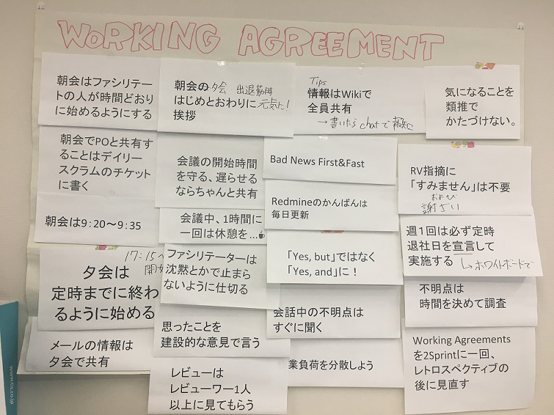

ワーキングアグリーメント
===============

## 目的

集団がストレスを抱えず、衝突することなく仕事を進めるためには「価値観の共有」が必要です。  
「価値観の共有」は、一定のルールを設け、それをみんなが守り続けることが必要です。  

ルールをリーダーが決めてチームメンバーに守らせるというやり方もありますが、  
チームメンバー全員でルールを作るようにしてください。  
「自分たちで作って、自分たちで守る」ことにより自律したチームとなる一歩となります。  

なお、ワーキングアグリーメントは、アジャイルな開発では良く採用されているプラクティスですが、  
ウォーターフォール開発等の他の開発スタイルの開発チームでも有効なプラクティスです。  

## 原則

* 規範は自分たちが活動をしやすくするために自分たちで議論して決める
* チーム全員が議論して納得した内容を明文化する
  * チーム全員で議論することが大事

## 運用

1. プロジェクト開始時にチームでワーキングアグリーメントを決定するための議論をする
1. ワーキングアグリーメント決定後はチームの見える場所に配置する
 * 壁に貼り出す
 * 追加/変更を行いやすいように、１つの付箋（紙）に１ルールを記述し、台紙に貼ると良い
1. ワーキングアグリーメントは定期的に見直す
 * 例えば2スプリントに1回見直しをする

## 例

* 朝会（デイリースクラム）は9：05～9：20
* 検討事項・相談事項は朝会朝会の後に個別で実施する
* 30分考えて分からなければ、他の人に相談する（30分ルール）
* 会話中の不明点はすぐに聞く
* TipsはWikiで共有
* Bad News first/fast
* 会議は1H以内（ただしスプリント計画は時間かけてやるべき）
* リアクションを必ず行う
* チャットは常に見る
* 声を荒げず冷静に話す
* 「In Progress」にタスクを残したまま帰らない。終わらなかった場合は「New」へ戻す
* タスクに必ず予定時間を設定する
* タスククローズ時は必ず「作業時間」に実績値を入力する
* 当日中にマージする。時間外に実装してレビューア不在の場合は、翌日の朝イチにコードレビューとマージを依頼する

## ライセンス

この 作品 は <a rel="license" href="http://creativecommons.org/licenses/by-sa/4.0/">クリエイティブ・コモンズ 表示 - 継承 4.0 国際 ライセンス</a>の下に提供されています。
 
