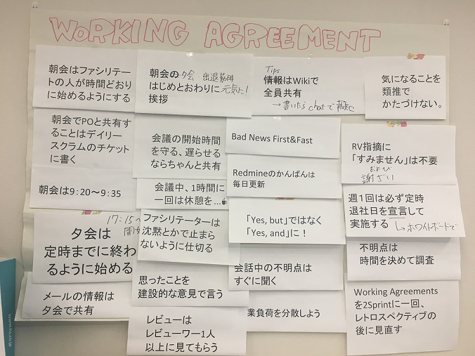

Working agreement
==================

## Purpose

A group needs to have shared values in order to carry out their work without becoming stressed or clashing. 
In order to maintain shared values, rules need to be decided upon and everyone must follow those rules.  

Often, the leader makes the rules and ensures that the team members follow them, but it is better if all of the team members are involved in making the rules. 
Rules made by and for the team are a step toward an autonomous team.  

Working agreements are a common practice in agile development, but they are also an effective practice for other development styles such as waterfall development. 

## Principles

* Standards that will make the team’s activities easier are discussed and decided by the team members themselves.
* Points discussed and agreed upon by the team are documented. 
  * It is important that everyone in the team is involved in the discussion.

## Operation

1. At the beginning of a project, facilitate a discussion between the team members to decide on a working agreement.
1. After the working agreement is decided on, place it in an area where the team can see it.
 * Place the working agreement on the wall.
 * Write each rule on its own sticky note or other sheet of paper and attach the rules to a large piece of paper so that rules can be added and changed easily.
3. Review the working agreement regularly.
 * For example, it could be reviewed once every two sprints.

  
*A working agreement*

## Examples

* Daily scrum 9:05-9:20am
* Discuss points requiring verification or advice individually after the daily scrum
* 30 Minute Rule: If you are still not sure of something after thinking about it for 30 minutes, ask someone for advice
* Ask immediately if you are unsure of anything during a conversation
* Share tips on the Wiki
* Bad News first/fast
* Meetings no longer than 1 hour (except for sprint plans, which need more time)）
* Always respond
* Keep an eye on chats at all times
* Speak calmly without raising your voice
* Do not go with “In Progress” tasks remaining. Return unfinished tasks to “New”. 
* Always set an expected number of hours for a task
* Always record working time when closing a task
* Merge during the same day. If you are working overtime when the reviewer is not there, request a code review and merge first thing in the morning. 

## Licensing

This document is provided under the <a rel="license" href="http://creativecommons.org/licenses/by-sa/4.0/">international Creative Commons Attribution-ShareAlike 4.0 license</a>.
 
